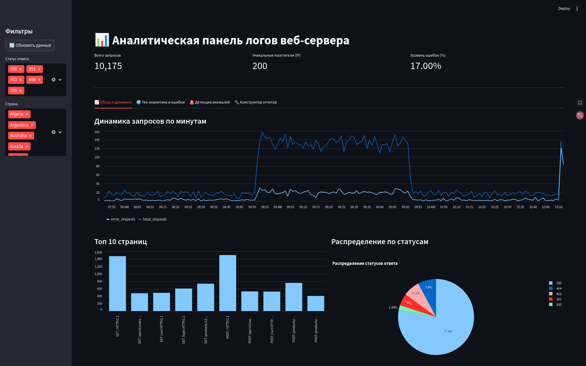
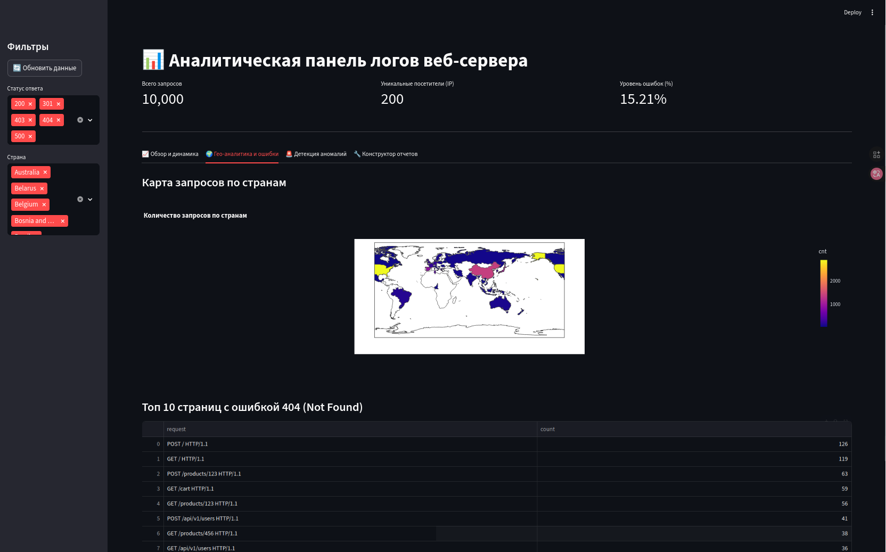
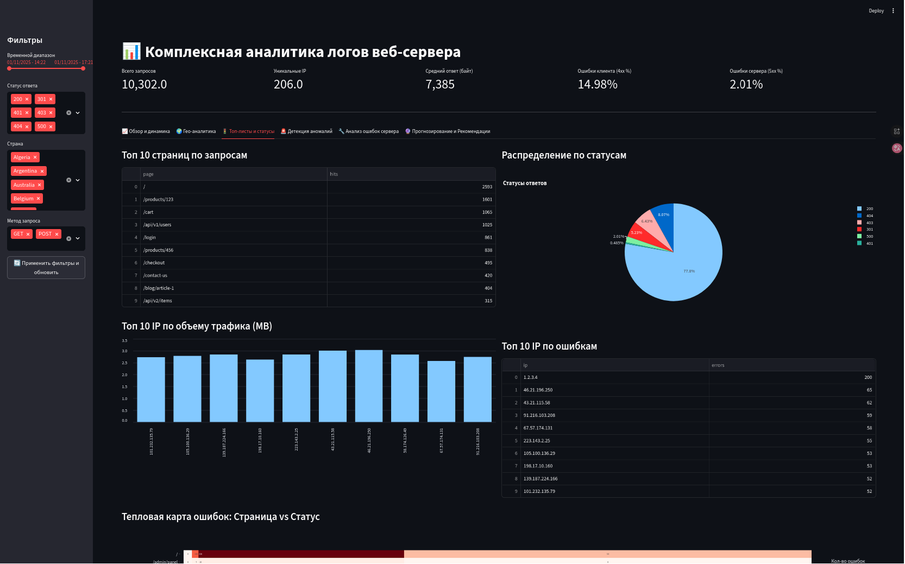
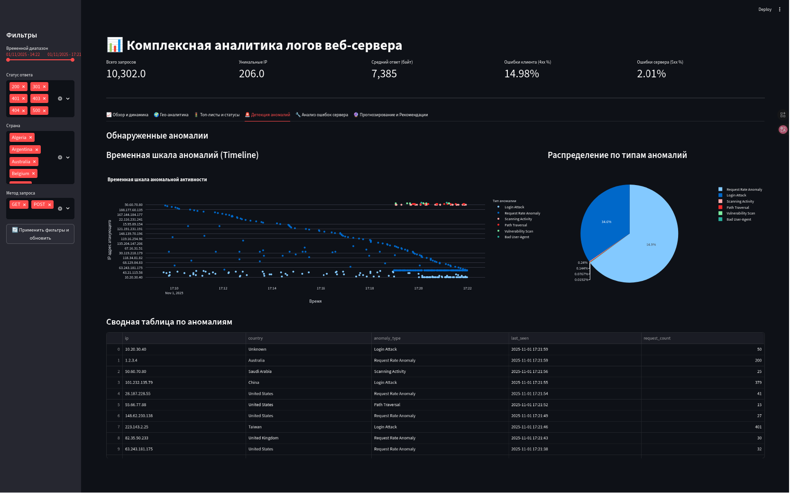
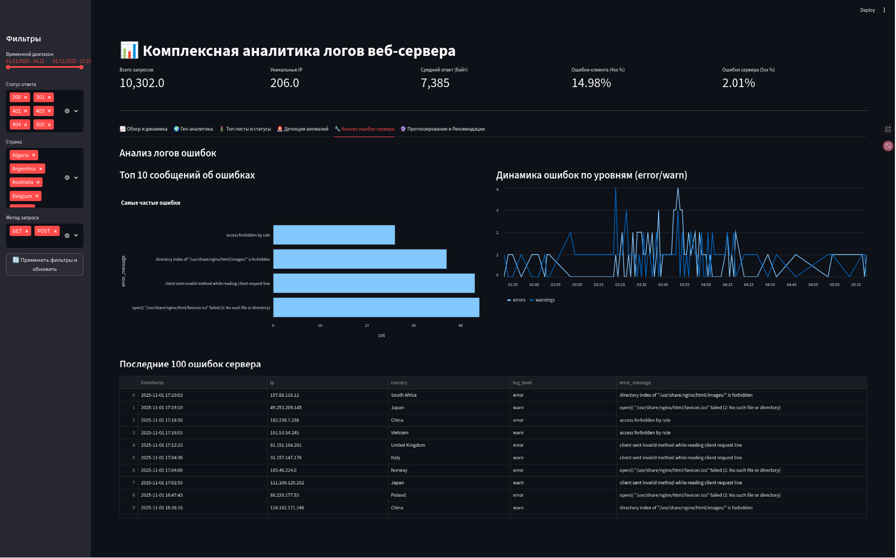
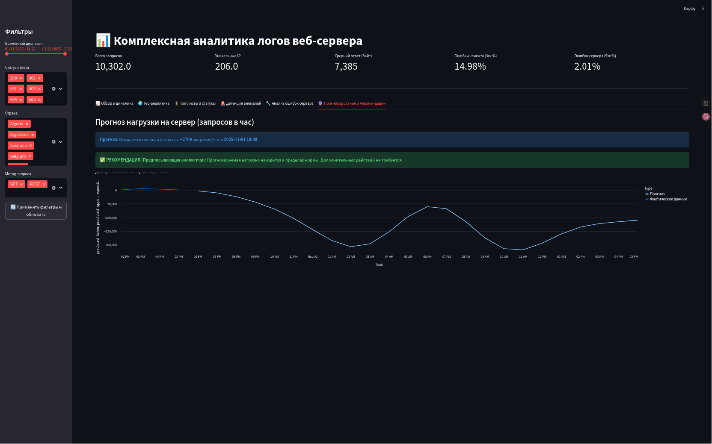
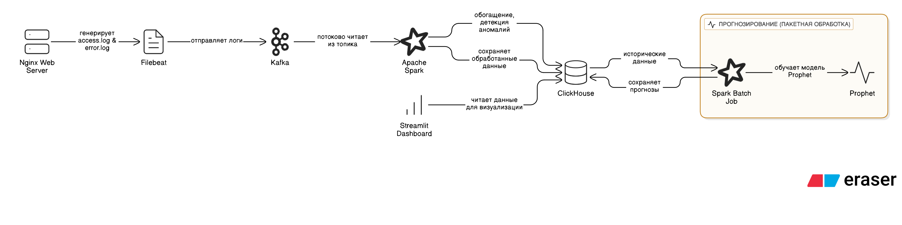

# Real-Time Log Analytics and Anomaly Detection Platform

<style>
.gallery{display:flex;flex-direction:column;gap:8px;width:100%;}
.gallery .row{display:flex;gap:8px;align-items:stretch;flex-wrap:nowrap;}
.gallery .large{flex:2 1 60%;min-width:220px;}
.gallery .column{flex:1 1 35%;display:flex;flex-direction:column;gap:8px;min-width:140px;}
.gallery img{width:100%;height:100%;object-fit:cover;border-radius:6px;display:block;}
@media (max-width:900px){
    .gallery .row{flex-direction:column;}
    .gallery .column{flex-direction:row;}
    .gallery .column img{height:auto;}
}
</style>

<div class="gallery">
    <div class="row">
        <div class="large">
            
        </div>
        <div class="column">
            
            
        </div>
    </div>
    <div class="row">
        <div class="large">
            
        </div>
        <div class="column">
            
            
        </div>
    </div>
</div>


Этот проект представляет собой комплексную платформу для сбора, обработки и анализа логов веб-сервера Nginx в режиме, близком к реальному времени. Система не только визуализирует данные на интерактивном дашборде, но и использует потоковую обработку для выявления аномалий в трафике, а также включает в себя модуль для прогнозирования будущей нагрузки на сервер.

## 📖 Содержание

- [Ключевые возможности](#-ключевые-возможности)
- [Технический стек и архитектура](#-технический-стек-и-архитектура)
- [Начало работы](#-начало-работы)
  - [Предварительные требования](#-предварительные-требования)
  - [Установка и запуск](#-установка-и-запуск)
  - [Генерация тестовых данных](#-генерация-тестовых-данных)
  - [Обучение прогностической модели](#-обучение-прогностической-модели)
- [Доступ к сервисам](#-доступ-к-сервисам)
- [Обзор дашборда](#-обзор-дашборда)
- [Структура проекта](#-структура-проекта)
- [Возможные улучшения](#-возможные-улучшения)

## ✨ Ключевые возможности

*   **Потоковая обработка данных:** Логи собираются и отправляются в Apache Kafka, после чего обрабатываются в Apache Spark Streaming.
*   **Интерактивный дашборд:** Панель мониторинга на базе Streamlit для всестороннего анализа данных с фильтрами и различными типами визуализаций.
*   **Детекция аномалий:** Spark анализирует трафик "на лету" для выявления различных видов аномальной активности:
    *   **Сигнатурный анализ:** SQL-инъекции, Path Traversal, сканирование уязвимостей, вредоносные User-Agent.
    *   **Поведенческий анализ:** Аномальная частота запросов, брутфорс-атаки на страницу логина, сканирование страниц.
*   **Прогностическая аналитика:** Обучение модели (Prophet) на исторических данных для прогнозирования нагрузки на сервер на 24 часа вперед.
*   **Предписывающая аналитика:** Дашборд предоставляет рекомендации по масштабированию на основе прогнозов.
*   **Геопространственный анализ:** IP-адреса обогащаются данными о геолокации для визуализации запросов и ошибок на карте мира.
*   **Масштабируемая архитектура:** Все компоненты системы контейнеризированы с помощью Docker, что упрощает развертывание и масштабирование.

## 🛠️ Технический стек и архитектура

Платформа построена на взаимодействии нескольких ключевых сервисов, образующих конвейер обработки данных (data pipeline).

**Схема потока данных:**


*   **Nginx:** Веб-сервер, генерирующий исходные данные (логи доступа и ошибок).
*   **Filebeat:** Агент для сбора и отправки логов в Kafka.
*   **Apache Kafka:** Брокер сообщений, который служит буфером для потоковых данных.
*   **Apache Spark:** Система распределенной обработки данных. Используется для:
    *   Чтения данных из Kafka в потоковом режиме.
    *   Парсинга, обогащения (геоданные) и анализа логов.
    *   Детекции аномалий.
    *   Пакетного обучения прогностической модели.
*   **ClickHouse:** Быстрая столбцовая СУБД, идеально подходящая для хранения аналитических данных и выполнения быстрых запросов от дашборда.
*   **Streamlit:** Фреймворк для создания интерактивного веб-дашборда на Python.
*   **Docker & Docker Compose:** Инструменты для контейнеризации и оркестрации всего стека приложений.

## 🚀 Начало работы

### Предварительные требования

*   **Docker** (версия 20.10.0+).
*   **Docker Compose** (версия 1.29.0+).
*   **Python 3.9+** на вашем локальном компьютере (для запуска скрипта генерации логов).
*   **Git** для клонирования репозитория.

### Установка и запуск

1.  **Клонируйте репозиторий:**
    ```bash
    git clone <URL_вашего_репозитория>
    cd <имя_папки_проекта>
    ```

2.  **Загрузите базу данных GeoLite2:**
    Детекция страны по IP требует базу данных от MaxMind.
    *   Зарегистрируйтесь на [сайте MaxMind](https://www.maxmind.com/en/geolite2/signup) для получения бесплатной лицензии.
    *   Скачайте архив `GeoLite2-Country.tar.gz`.
    *   Распакуйте его и поместите файл `GeoLite2-Country.mmdb` в директорию `spark/`.
    ```
    # Структура должна быть такой:
    project_folder/
    ├── spark/
    │   ├── GeoLite2-Country.mmdb  <-- ПОМЕСТИТЕ ФАЙЛ СЮДА
    │   ├── Dockerfile
    │   └── ...
    └── ...
    ```

3.  **Соберите и запустите все сервисы:**
    ```bash
    docker-compose up --build -d
    ```
    Эта команда скачает образы, соберет кастомные (для Spark и Streamlit) и запустит все контейнеры в фоновом режиме.

### Генерация тестовых данных

После запуска система готова к приему данных. Чтобы сгенерировать реалистичные логи, включая аномалии:

1.  **Установите зависимости для скрипта:**
    ```bash
    pip install faker
    ```

2.  **Запустите скрипт генерации:**
    ```bash
    python3 generate_logs.py
    ```
    Скрипт создаст файлы `access.log` и `error.log` в папке `nginx/logs`. Filebeat автоматически подхватит их и отправит в систему. Через 15-30 секунд данные начнут появляться на дашборде.

### Обучение прогностической модели

Этот шаг выполняется вручную после того, как в системе накопится достаточное количество данных.

1.  **Запустите обучение модели:**
    ```bash
    docker-compose exec spark /opt/spark/bin/spark-submit /opt/spark-apps/train_model.py
    ```
    Этот скрипт возьмет исторические данные из ClickHouse, обучит модель и сохранит ее.

2.  **Сгенерируйте прогноз:**
    ```bash
    docker-compose exec spark /opt/spark/bin/spark-submit /opt/spark-apps/make_predictions.py
    ```
    Этот скрипт загрузит обученную модель и сохранит прогноз на следующие 24 часа в ClickHouse.

## 🖥️ Доступ к сервисам

*   **Тестовая страница Nginx:** `http://localhost:8080`
*   **Дашборд Streamlit:** `http://localhost:8501`

## 📊 Обзор дашборда

Дашборд разделен на несколько вкладок для удобства анализа:

*   **📈 Обзор и динамика:** KPI (всего запросов, уникальные IP), динамика запросов по типам ответов.
*   **🌍 Гео-аналитика:** Карты мира с распределением запросов и уровнем ошибок по странам.
*   **🚦 Топ-листы и статусы:** Топ-10 страниц, IP-адресов по трафику и ошибкам, распределение HTTP-статусов.
*   **🚨 Детекция аномалий:** Временная шкала аномальной активности, распределение по типам аномалий и сводная таблица.
*   **🔧 Анализ ошибок сервера:** Анализ логов ошибок, топ сообщений, динамика по уровням (error/warn).
*   **🔮 Прогнозирование и Рекомендации:** График сравнения фактической нагрузки с прогнозом и автоматические рекомендации по управлению ресурсами.

## ⚙️ Структура проекта

```
.
├── clickhouse/
│   └── init.sql            # SQL-схема для таблиц ClickHouse
├── filebeat/
│   └── filebeat.yml        # Конфигурация Filebeat
├── nginx/
│   ├── logs/               # Директория для лог-файлов (генерируется)
│   ├── site1/              # Файлы тестового сайта
│   └── nginx.conf          # Конфигурация Nginx
├── spark/
│   ├── GeoLite2-Country.mmdb # База данных GeoIP (добавляется вручную)
│   ├── spark_processor.py    # Основной скрипт потоковой обработки
│   ├── train_model.py      # Скрипт обучения модели
│   ├── make_predictions.py # Скрипт генерации прогнозов
│   └── Dockerfile          # Dockerfile для Spark
├── streamlit/
│   ├── dashboard.py        # Код дашборда Streamlit
│   └── Dockerfile          # Dockerfile для Streamlit
├── docker-compose.yml      # Файл для оркестрации всех сервисов
├── generate_logs.py        # Скрипт для генерации тестовых логов
└── README.md               # Этот файл```

## 💡 Возможные улучшения

*   **Автоматизация обучения:** Интегрировать Airflow или использовать cron для периодического запуска скриптов обучения модели и генерации прогнозов.
*   **Система оповещений:** При обнаружении критических аномалий отправлять уведомления в Slack, Telegram или по email.
*   **Более сложные ML модели:** Использовать LSTM или ARIMA для более точного прогнозирования, а также модели вроде Isolation Forest для детекции аномалий.
*   **CI/CD:** Настроить конвейер для автоматической сборки и развертывания проекта.